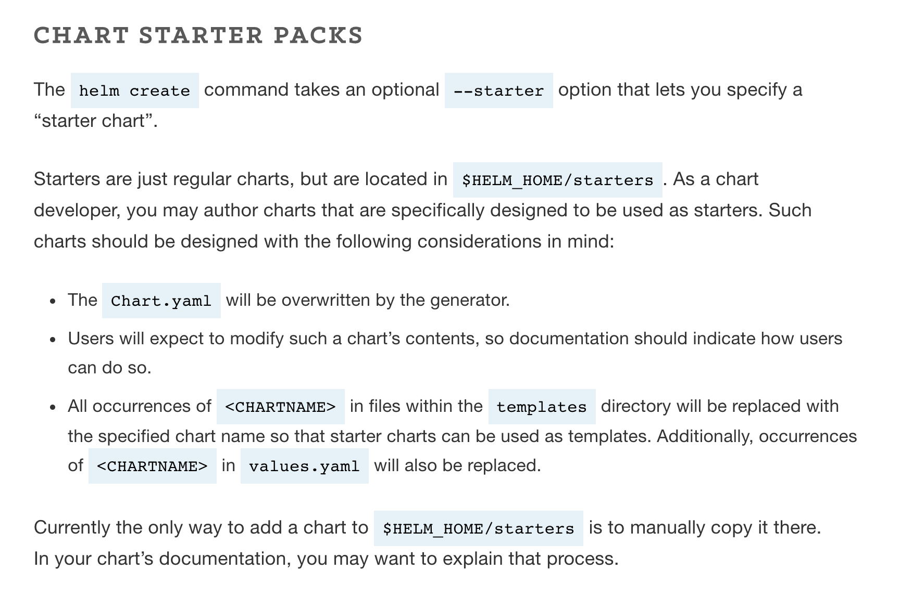

# Helm Starter
This is a collection of Helm chart starters. It provides a selection of preset chart template (a.k.a. scaffold) for quick bootstrapping of a Helm chart.

## About Chart Starter


Ref: https://helm.sh/docs/developing_charts/#chart-starter-packs

## Getting Started

1. Clone this repository.

2. Copy the intended scaffold (e.g. `spring-boot`) into `$(helm home)/starters/`.
```bash
cp spring-boot ~/.helm/starters
```

3. Use `-p` or `--starter` to specify your starter when running `helm create`.
```bash
helm create my-chart -p spring-boot
```