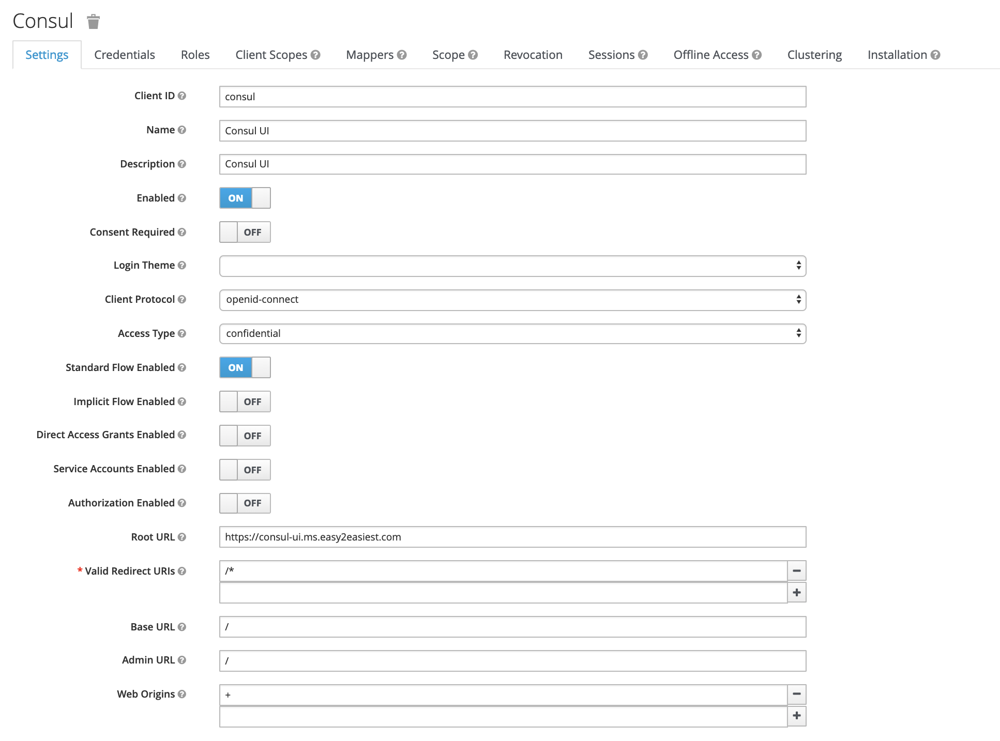
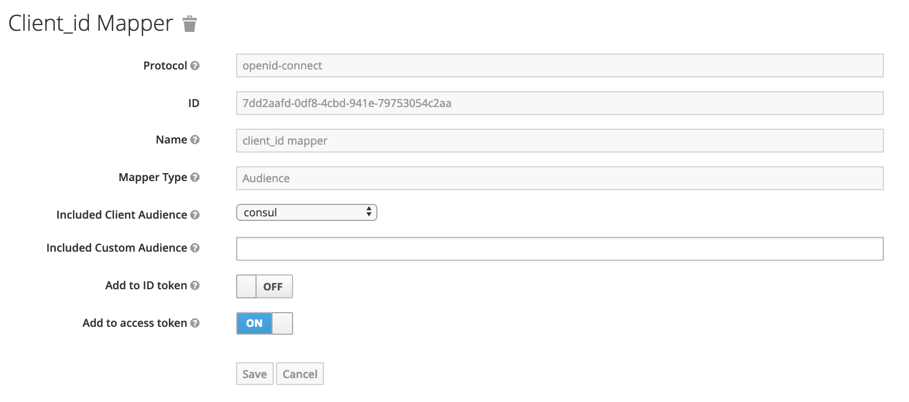

# `keycloak-gatekeeper`
[Keycloak Gatekeeper](https://www.keycloak.org/docs/latest/securing_apps/index.html#_keycloak_generic_adapter) is a generic adapter for Keycloak authentication service, previously known as Keycloak Proxy.

It acts as an **authentication proxy** that restricts the access of a service by mandating an authentication with a Keycloak server. This is useful to protect any out-of-the-box services/applications that does not have native authentication support, such as [Hashicorp Consul UI](https://learn.hashicorp.com/consul/getting-started/ui). 

## Keycloak
A running Keycloak instance is a prerequisite, which can be installed using [`stable/keycloak`](https://github.com/helm/charts/tree/master/stable/keycloak).

### Creating Keycloak Client


### Creating Mapper for Keycloak Client
There is a [known issue](https://github.com/keycloak/keycloak-documentation/blob/master/securing_apps/topics/oidc/keycloak-gatekeeper.adoc#known-issues) with `keycloak/keycloak-gatekeeper` (still happening in `5.0.0`) in which Gatekeeper is unable to find the client_id in the aud claim. This is due to the fact the `client_id` is not in the audience anymore.

The workaround is to add the "Audience" protocol mapper to the client with the audience pointed to the `client_id`. For more information, see [KEYCLOAK-8954](https://issues.jboss.org/browse/KEYCLOAK-8954).


### Store Client Secret in a Kubernetes Secret
The chart retrieves client secret from a Kubernetes Secret.

Below is a sample command to create the Kubernetes Secret. Note that this method is only for demo purposes, because it is unsafe in which the secret is exposed in clear text in the command. 
```
kubectl create secret generic gatekeeper --from-literal=clientSecret=300cb1d4-415d-44ad-86ab-37e20b2ae59c
```

## Configuration options 

| Parameter      					| Description                                                	 | Default 														 |
| --------------------------------- | -------------------------------------------------------------- | :-----------------------------------------------------------: |
| `gatekeeper.clientId` 			| Client ID used to authenticate to Keycloak server. 			 | ``             												 |
| `gatekeeper.listen`  				| The interface the service should be listening on.				 | `0.0.0.0:3000`     											 |
| `gatekeeper.discoveryUrl`  		| Keycloak URL to retrieve the openid configuration.  			 | ``															 |
| `gatekeeper.upstreamUrl`     		| URL of service to proxy to.                                	 | ``															 |
| `gatekeeper.resources` 			| List of protected resources.                            		 | `uri=/*`      												 |
| `gatekeeper.verbose`       		| Switch on debug / verbose logging.              				 | `true`    													 |
| `gatekeeper.enableLogging`	    | Enable logging for all requests. 								 | `true`    													 |
| `secret.name`						| Name of Kubernetes secret storing client secret.				 | `gatekeeper`    												 |
| `secret.clientSecretKey`			| Name of key for the client secret stored in Kubernetes secret. | `clientSecret`    											 |

Complete configuration list for Keycloak Gatekeeper application, but not all are implemented in this Helm chart:
https://github.com/keycloak/keycloak-gatekeeper/blob/master/doc.go

## Miscellaneous

### Helm Chart Alternatives
* gabibbo97's [`charts/keycloak-gatekeeper`](https://github.com/gabibbo97/charts/tree/master/charts/keycloak-gatekeeper)

### Source Code
* Main GitHub: https://github.com/keycloak/keycloak-gatekeeper
* Dockerfile GitHub: https://github.com/jboss-dockerfiles/keycloak
* DockerHub: https://hub.docker.com/r/keycloak/keycloak-gatekeeper