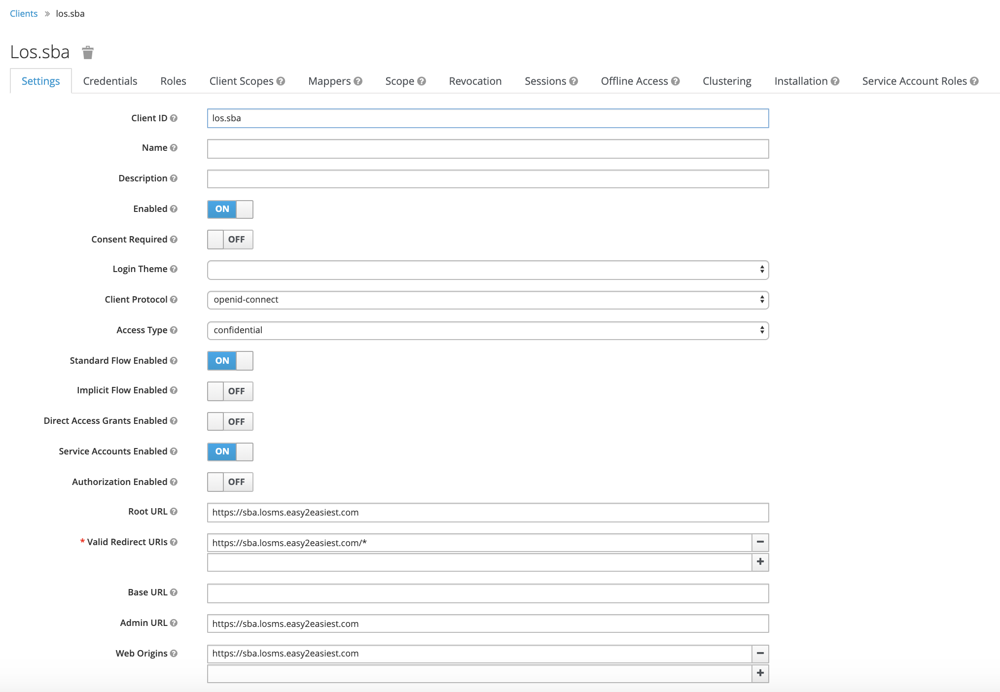

# sba
`sba` is an implementation of [Spring Boot Admin](https://github.com/codecentric/spring-boot-admin).

## Features
* Keycloak authentication.
* Detect custom management url of discovered instances.

## Keycloak Client Configuration
